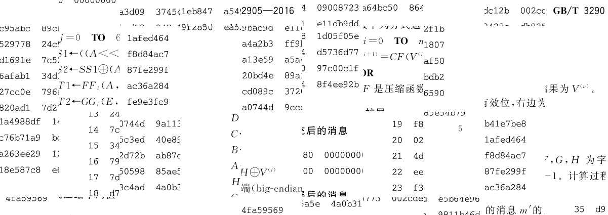

# mhtml-to-pdf

将[国家标准全文公开系统](https://openstd.samr.gov.cn/bzgk/gb/index)公布的GB/T文档保存为mhtml文件，使用此工具可转换为pdf。

## 安装

使用 python3 编译安装。

```bash
python3 setup.py install
```

如果仅给当前用户安装，请执行：

```bash
python3 setup.py install --user
```

## 使用方法

```bash
mhtml-to-pdf -m /path/to/gbt-mhtml.mhtml -o /path/to/gbt-mhtml.pdf
mhtml-to-pdf -m /path/to/gbt-mhtml.mhtml -d /path/to/ # 输出 /path/to/gbt-mhtml.pdf
mhtml-to-pdf -m /path/to/gbt-mhtml.mhtml -d /path/to/ -n newfile.pdf # 输出 /path/to/newfile.pdf
```

## 为什么做这个工具

因为GB/T文档原型是这样的：


